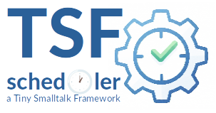

|<sub>🇬🇧 [English translation →](README.en.md)</sub>|
|----:|
|    |

|[](https://pharo.org)|[](./LICENSE) [](#)|
|----|----|
|| ***TSF-Scheduler***<br>Ein robustes, threadsicheres und ressourcenschonendes Framework zur Aufgabenplanung für Smalltalk. Teil der **TSF (Tiny Smalltalk Framework)**-Suite|

<sup>***TSF*** steht für ***Tiny Smalltalk Framework*** — eine Sammlung von minimalistischen Tools für robuste Anwendungen.</sup>


## Überblick

`TSF-Scheduler` bietet einen leistungsstarken Mechanismus zur Verarbeitung asynchroner Hintergrundprozesse und periodischer Aufgaben. Es wurde mit Blick auf Stabilität und einfache Bedienbarkeit "Smalltalk-Way"entwickelt, Es wird klar unterschieden zwischen  **scheduling logic** (Timer) und **execution logic** (Worker).

## Hauptmerkmale

* **Thread-Safe:** Zum Schutz der Warteschlangen-Queue und für atomare Operationen wird der Mechanismus *`Mutex`* verwendet.
* **Architecture:** Trennung der Zuständigkeiten zwischen *`TsfCron`* (Timer) und *`TsfScheduler`* (Worker).
* **Dual Mode:** Unterstützt werden sowohl **Blocks** (für schnelles scripting) als auch **Subclasses** (für "clean Command Pattern Architecture").
* **Smart Scheduling:** Um das "Stapeln" von Task in der Ausführungs-Queue zu verhindern, wird eine **Fixed Delay** Strategie für periodische Tasks verwendet. Ein Task wird erst *nach* seiner Beendigung wieder in den Scheduler geschoben.
* **Idempotency:** Sicheres updating der Task-Konfiguration zur Laufzeit ohne die Jobs zu duplizieren.
* **Lifecycle Management:** Unterstützt Lifecycle Stati für *`pause`*, *`resume`*, und *`cancel`* von laufenden Tasks.
* **Graceful Shutdown:** Kooperatives Thread-Termination stellt sicher, daß Resourcen in keinem inkonsistenten Zustand verbeliben.

## Installation

```smalltalk
Metacello new
    baseline: 'TsfScheduler';
    repository: 'github://georghagn/TSF-Scheduler';
    load.
```

## Usage

### 1. Starting the System

*TSF Scheduler* besteht aus Scheduler (führt Tasks aus) und Cron (verwaltet Scheduling-Zeitpunkte).

```smalltalk
TsfScheduler current start.
TsfCron current start.
```

### 2. One-Off Tasks (Fire and Forget)

Für einfache "background operations"" können Smalltalk-Blöcke direct mit dem Scheduler benutzt werden

```smalltalk
TsfScheduler current scheduleBlock: [ 
    (Delay forSeconds: 2) wait.
    Transcript show: 'Background job finished!'; cr.
].
```

### 3. Periodic Tasks (The "Scripting" Way)

Es können sich wiederholende Tasks in den Scheduler gestellt werden. Die Methode *ensureTaskNamed:* verhindert doppelte Tasks beim erneuten anlaufen der scripts.

```smalltalk
TsfCron current 
    ensureTaskNamed: 'System Cleanup' 
    frequency: 10 minutes
    action: [ 
        Transcript show: 'Running cleanup...'; cr.
        "Cleanup logic here"
    ].
```

### 4. Periodic Tasks (The "Robust" Way)

Für komplexere Logiken sollte man große Blöcke vermeiden. Stattdessen kann man eine Subclass von *TsfTask* anlegen und entsprechende execute-actions implementieren.

**Define the class:**

```smalltalk
TsfTask subclass: #LogRotationTask
    instanceVariableNames: ''
    package: 'MyApp-Maintenance'
```

**Implement the logic:**

```smalltalk
LogRotationTask >> executeAction
    Transcript show: 'Rotating logs...'; cr.
    "Complex logic goes here, e.g., file access, compression"
```

**Schedule it:**

```smalltalk
TsfCron current 
    ensureTask: 'Log Rotation' 
    class: LogRotationTask 
    frequency: 1 hour.
```

### 5. Lifecycle Control

Bereits gestartete Tasks können sogar nach ihrem Start noch kontrolliert werden.

```smalltalk
| task |
task := TsfCron current findTaskByName: 'System Cleanup'.

task pause.   "Stops execution, but keeps the timer ticking"
task resume.  "Resumes execution"
task cancel.  "Permanently stops and removes the task"
```

## Architectur

- **TsfScheduler:** Ein *Singleton worker* , welcher die Task-Queue verarbeitet. Er hat keine Ahnung von Zeit, nur von Arbeit. Er verarbeitet Tasks sequentiell in einem Background-Prozess.
- **TsfCron:** Ein *Singleton timer* , welcher eine priorisierte Queue von periodischen Tasks verwaltet. Er wacht nur auf, wenn ein Task an der Reihe ist, oder wenn ein neuer Task hinzugefügt wird. (Interruptible Wait), dies stellt sicher, dass die CPU im Idle Modus zu 0% belastet wird.

## Error Handling

Aufgaben fangen ihre eigenen Fehler ab, um einen Absturz des Worker-Threads zu verhindern. Sie können für jede Aufgabe einen eigenen Fehlerbehandler oder einen globalen Fehlerbehandler definieren.

```smalltalk
TsfScheduler current globalErrorHandler: [ :task :error |
    Transcript 
		show: 'Critical failure in ';
		showCr: task name.
].
```
## Entwicklungsprozess & Credits

Ein besonderer Dank gilt meinem KI-Sparringspartner für die intensiven und wertvollen Diskussionen während der Entwurfsphase. Die Fähigkeit der KI, verschiedene Architekturansätze (wie Polling-Loops vs. Priority Queues) schnell zu skizzieren und Vor- und Nachteile abzuwägen, hat die Entwicklung von `tsf-scheduler` erheblich beschleunigt und die Robustheit des Endergebnisses verbessert.


## License

MIT


