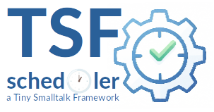

|<sub>🇩🇪 [German translation →](README.de.md)</sub>|
|----:|
|    |

|[](https://pharo.org)|[](./LICENSE) [](#)|
|----|----|
|| ***TSF-Scheduler***<br>A robust, thread-safe, lightweight and zero-dependency task scheduling framework for Smalltalk. Part of the **TSF (Tiny Smalltalk Framework)** suite.|

<sup>***TSF*** stands for ***Tiny Smalltalk Framework*** — a collection of minimalist tools for robust applications.</sup>


## Overview

`TSF-Scheduler` provides a powerful mechanism to handle asynchronous background jobs and periodic tasks. It is designed with stability and "Smalltalk-way" usability in mind, distinguishing clearly between **scheduling logic** (Timer) and **execution logic** (Worker).


## Key Features

* **Thread-Safe:** Uses *`Mutex`* for queue protection and atomic operations.
* **Architecture:** Separation of concerns with *`TsfCron`* (Timer) and *`TsfScheduler`* (Worker).
* **Smart Scheduling:** Uses a **Fixed Delay** strategy for periodic tasks to prevent execution stacking (a task is rescheduled only *after* it finishes).
* **Idempotency:** Safely re-evaluate and update task configurations at runtime without duplicating jobs.
* **Lifecycle Management:** Support for *`pause`*, *`resume`*, and *`cancel`* on running tasks.
* **Graceful Shutdown:** Cooperative thread termination ensures resources are not left in inconsistent states.


## Architecture

- **TsfScheduler:** A Singleton worker that consumes a queue of tasks. It has no concept of time, only work. It processes tasks sequentially in a background process.
- **TsfCron:** A Singleton timer that manages a priority queue of periodic tasks. It wakes up only when a task is due or a new task is inserted (Interruptible Wait), ensuring 0% CPU usage when idle.
- **TsfTask:** The atomic unit of work within the TSF Scheduler. It encapsulates **what** needs to be done (the logic) and **the current state** of that work (state management).


## Installation

```smalltalk
Metacello new
    baseline: 'TsfScheduler';
    repository: 'github://georghagn/TSF-Scheduler:main';
    load.
```

## Usage the Scheduler

### 1. Starting the Scheduler System

The system consists of the Scheduler (executes tasks) and the Cron (manages time).

```smalltalk
TsfScheduler current start.
TsfCron current start.
```

### 2. Scheduler One-Off Tasks (Fire and Forget)

For simple background operations, use blocks directly with the scheduler.

```smalltalk
TsfScheduler current scheduleBlock: [ 
    (Delay forSeconds: 2) wait.
    Transcript show: 'Background job finished!'; cr.
].
```

### 3. Scheduler Lifecycle Control

You can control tasks even after they have been scheduled.

```smalltalk
| task |
task := TsfCron current findTaskByName: 'System Cleanup'.

task pause.   "Stops execution, but keeps the timer ticking"
task resume.  "Resumes execution"
task cancel.  "Permanently stops and removes the task"
```

### 4. Scheduler Error Handling

Tasks catch their own errors to prevent crashing the worker thread. You can define per-task handlers or a global handler.

```smalltalk
TsfScheduler current globalErrorHandler: [ :task :error |
    Transcript 
		show: 'Critical failure in ';
		showCr: task name.
].
```

## Using TsfTask: The Generic Unit of Work


The "Dual Mode" Concept. The class supports two usage patterns, depending on the complexity of the task:

### 1. Task Scripting Mode (Ad-Hoc via Blocks)

Ideal for quick maintenance tasks, one-liners, or runtime configurations via the Workspace. In this mode, a `BlockClosure` (or `MessageSend`) is injected directly into the task.

**Pros:** No overhead from creating new classes.
**Usage:** Via `TsfCron >> #ensureTaskNamed:frequency:action:`

```smalltalk
"Example: A task that performs garbage collection every 5 minutes"
TsfCron current 
    ensureTaskNamed: 'GarbageCollector' 
    frequency: 5 minutes 
    action: [ Smalltalk garbageCollect ].
```

### 2. Task OOP Mode (Robust Smalltalk Way)

Ideal for complex logic that requires its own state, needs to be strictly testable, or has heavy dependencies. 

**Pros:** Clean encapsulation, reusability, and better testability.
**Usage:**

```smalltalk
"Definition"
Object subclass: #MyDatabaseExport
...

!MyDatabaseExport methodsFor: 'actions'!
runAction
    "Implement complex logic here"
    Database exportTo: 'backup.sql'.
    ^ 'Export successful'
! !

"Registration"
task := TsfTask 
            named: 'NightlyDBExport' 
            receiver: MyDatabaseExport 
            selector: #runAction 
            frequency: 24 hours.

task execute.
```

### 3. Task Lifecycle & State Machine

A task transitions through a defined lifecycle managed by the `TsfScheduler`.

  * `#pending`: Task is waiting for execution (Initial state).
  * `#running`: Task is currently being executed by the worker thread.
  * `#finished`: Successfully completed.
  * `#failed`: An error occurred (the exception is stored in `caughtError`).
  * `#cancelled`: Task was manually cancelled (will not be rescheduled).
  * `#skipped`: Task was paused (`isPaused`); execution was skipped, but the timer continues running.


### 4.Task Error Handling

Errors during execution are **not** ignored but caught safely:

1.  The state transitions to `#failed`.
2.  The exception is stored in `caughtError`.
3.  The task's `onFailure:` callback is executed (if defined).
4.  The scheduler's global error handler is notified.


```smalltalk
task onFailure: [ :err | Transcript show: 'Oops: ', err description ].
```


## Development-Process & Credits

Special thanks go to my AI sparring partner for the intensive and valuable discussions during the design phase. The AI's ability to quickly outline different architectural approaches (such as polling loops vs. priority queues) and weigh their pros and cons significantly accelerated the development of `tsf-scheduler` and improved the robustness of the final result.


## License

MIT


## Contact

If you have any questions or are interested in this project, you can reach me at   
📧 *dev.georgh [at] hconsult.biz*

<sup>*(Please do not send inquiries to the private GitHub account addresses.)*</sup>


